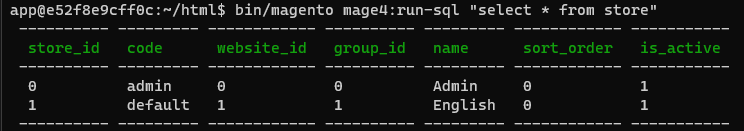
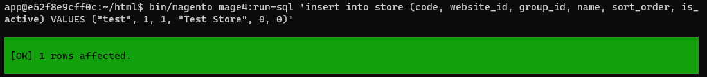
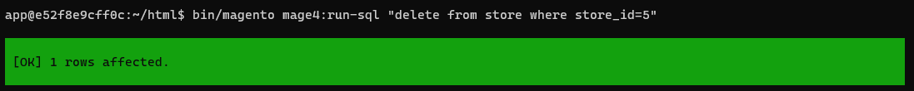
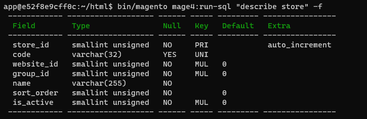

# Mage4 RunSql

**Magento extension** to run SQL queries directly from console command.

### Install via composer

```
composer require mage4/magento-run-sql

php bin/magento setup:upgrade
php bin/magento setup:di:compile
php bin/magento setup:static-content:deploy
```

### Install Package manually by copy-paste

Download the code from this repo under Magento® 2 following directory:

```
app/code/Mage4/RunSql
``` 
And run following commands to enable the module:
```
php bin/magento setup:upgrade
php bin/magento setup:di:compile
php bin/magento setup:static-content:deploy
```

## Features

- Execute DDL queries.
- Execute DML queries.
- Execute DQL queries.

## Examples

- Select records from `store` table:
```
bin/magento mage4:run-sql "select * from store"
```


- Insert record into `store` table:
```
bin/magento mage4:run-sql 'insert into store (code, website_id, group_id, name, sort_order, is_
active) VALUES ("test", 1, 1, "Test Store", 0, 0)'
```


- Delete record from `store` table:
```
bin/magento mage4:run-sql "delete from store where store_id=5"
```


- Fetch `store` table schema:
```
bin/magento mage4:run-sql "describe store" -f
```


## About us
We’re an innovative development agency building awesome websites, webshops and web applications with Latest Technologies. Check out our website [mage4.com](http://mage4.com/) or [email](mailto:contact@mage4.com).


